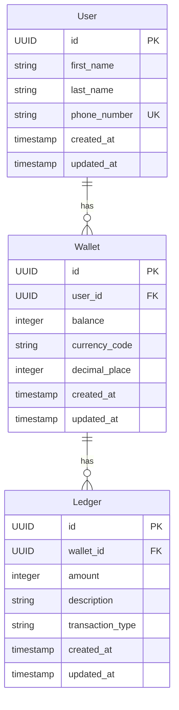

### Entity Relation Diagram

```mermaid
erDiagram
    User {
        UUID id PK
        string first_name
        string last_name
        string phone_number UK
        timestamp created_at
        timestamp updated_at
    }
    Wallet {
        UUID id PK
        UUID user_id FK
        integer balance
        string currency_code
        integer decimal_place
        timestamp created_at
        timestamp updated_at
    }
    Ledger {
        UUID id PK
        UUID wallet_id FK
        integer amount
        string description
        string transaction_type
        timestamp created_at
        timestamp updated_at
    }

    User ||--o{ Wallet : "has"
    Wallet ||--o{ Ledger : "has"
```

