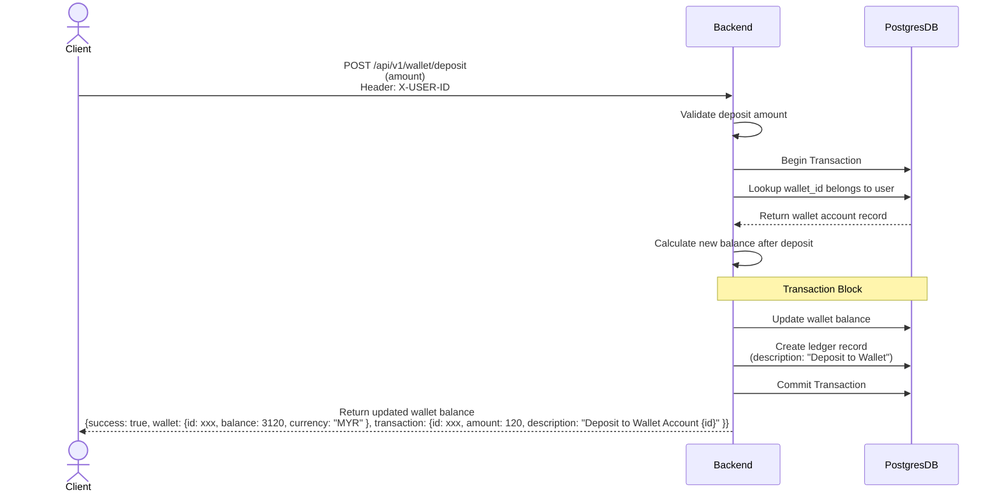
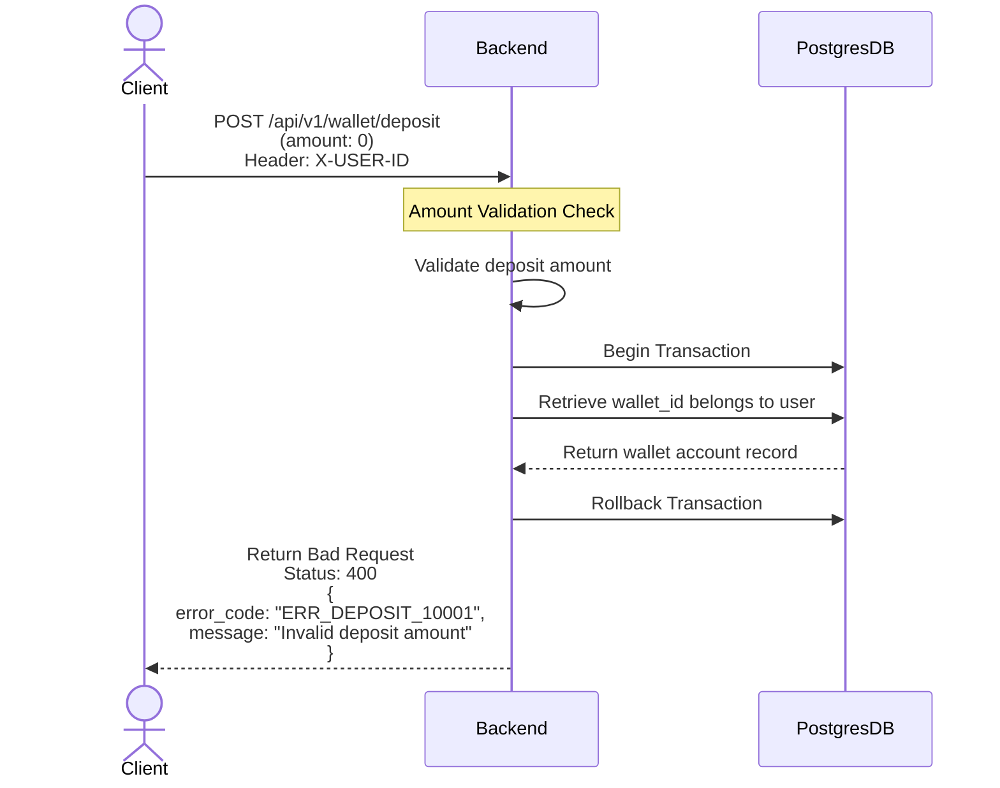

# Deposit Money

### Scenario 1: Success case

```mermaid
sequenceDiagram
    actor Client
    participant Backend
    participant PostgresDB

    Client->>Backend: POST /api/v1/wallet/deposit<br/>(amount)<br/>Header: X-USER-ID
    Backend->>Backend: Validate deposit amount
    Backend->>PostgresDB: Begin Transaction
    Backend->>PostgresDB: Lookup  wallet_id belongs to user
    PostgresDB-->>Backend: Return wallet account record
    Backend->>Backend: Calculate new balance after deposit
    Note over Backend,PostgresDB: Transaction Block
    Backend->>PostgresDB: Update wallet balance
    Backend->>PostgresDB: Create ledger record<br/>(description: "Deposit to Wallet")
    Backend->>PostgresDB: Commit Transaction
    Backend-->>Client: Return updated wallet balance<br/>{success: true, wallet: {id: xxx, balance: 3120, currency: "MYR" }, transaction: {id: xxx, amount: 120, description: "Deposit to Wallet Account {id}" }}
```

### Scenario 3: Deposit invalid amount

```mermaid
sequenceDiagram
    actor Client
    participant Backend
    participant PostgresDB

    Client->>Backend: POST /api/v1/wallet/deposit<br/>(amount: 0)<br/>Header: X-USER-ID
    Note over Backend: Amount Validation Check
	Backend->>Backend: Validate deposit amount
    Backend->>PostgresDB: Begin Transaction
    Backend->>PostgresDB: Retrieve wallet_id belongs to user
    PostgresDB-->>Backend: Return wallet account record
    Backend->>PostgresDB: Rollback Transaction
    Backend-->>Client: Return Bad Request<br/>Status: 400<br/>{<br/>error_code: "ERR_DEPOSIT_10001",<br/>message: "Invalid deposit amount"<br/>}
```
