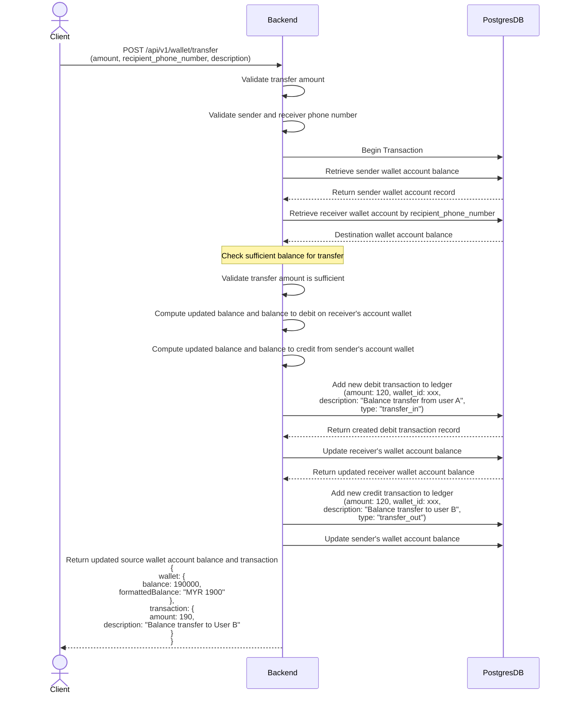
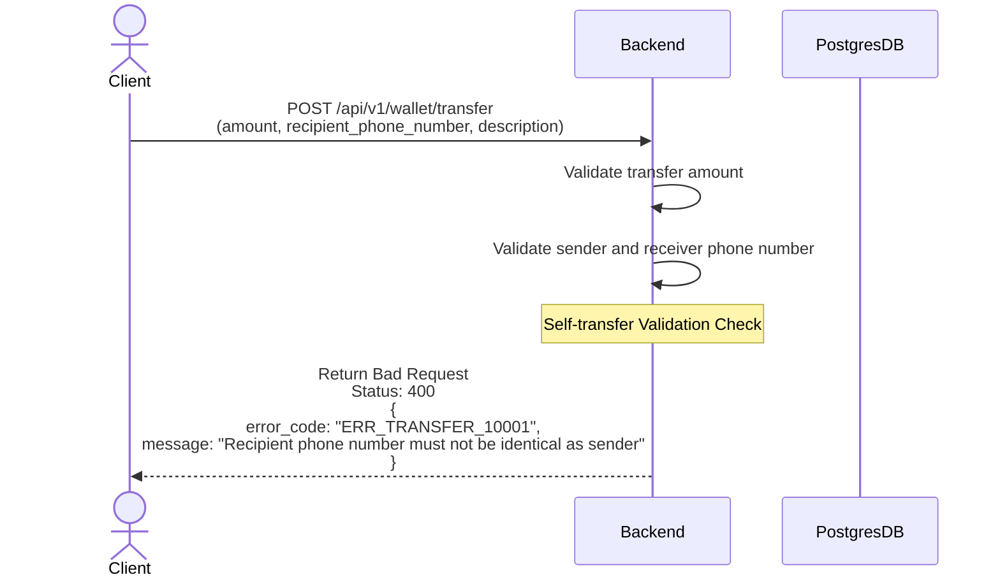
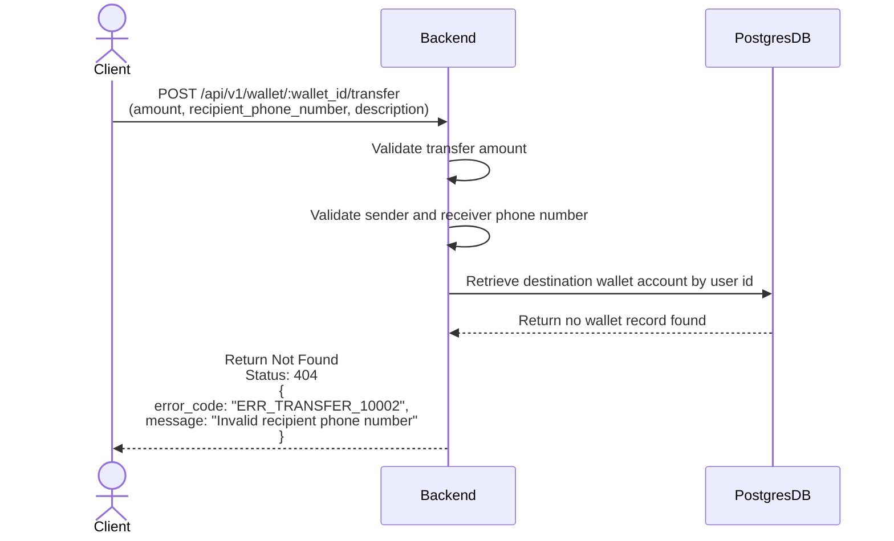
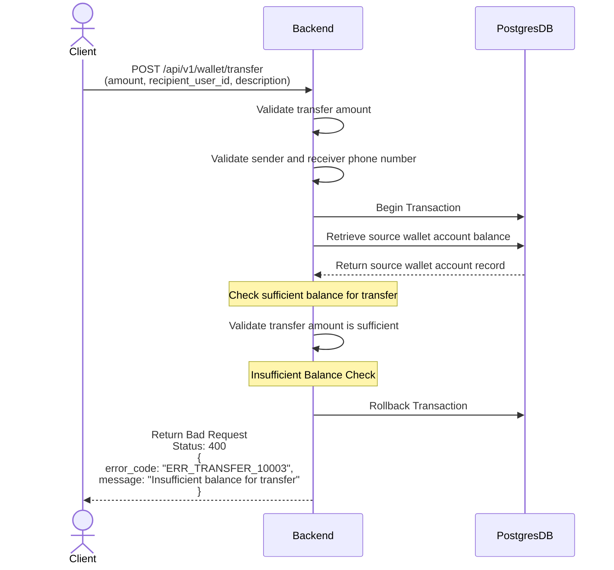

### Scenario 1: Transfer to User B wallet account

### Scenario 2: Transfer balance to recipient that is identical with the source user id

### Scenario 3: Transfer to unknown destination account

### Scenario 4: Transfer amount exceed the existing wallet balance

