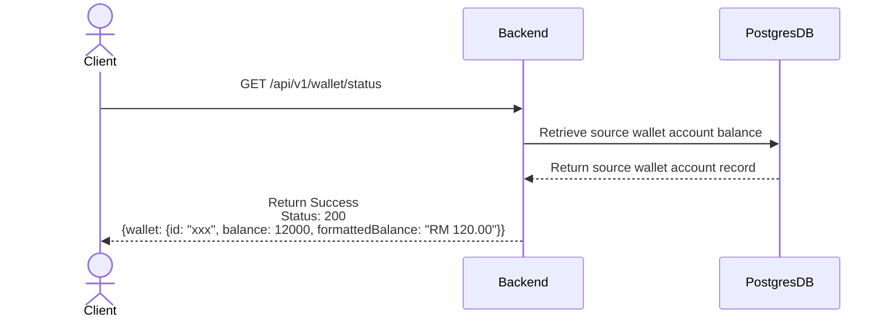
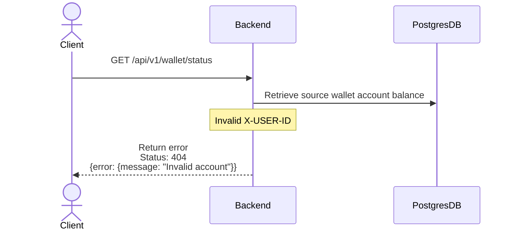

### Scenario 1: With correct user id in session

```mermaid
sequenceDiagram
    actor Client
    participant Backend
    participant PostgresDB

    Client->>Backend: GET /api/v1/wallet/status<br/>
    Backend->>PostgresDB: Retrieve source wallet account balance
    PostgresDB-->>Backend: Return source wallet account record
    Backend-->>Client: Return Success<br/>Status: 200<br/>{wallet: {id: "xxx", balance: 12000, formattedBalance: "RM 120.00"}}
```

### Scenario 2: With invalid user id presented in X-USER-ID header

```mermaid
sequenceDiagram
    actor Client
    participant Backend
    participant PostgresDB

    Client->>Backend: GET /api/v1/wallet/status<br/>
    Backend->>PostgresDB: Retrieve source wallet account balance
    Note over Backend: Invalid X-USER-ID

    Backend-->>Client: Return error<br/>Status: 404<br/>{error: {message: "Invalid account"}}
```

