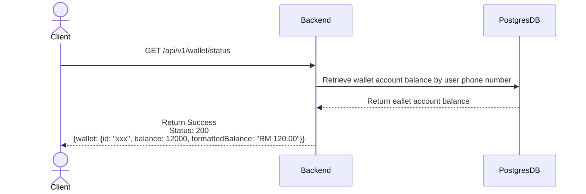
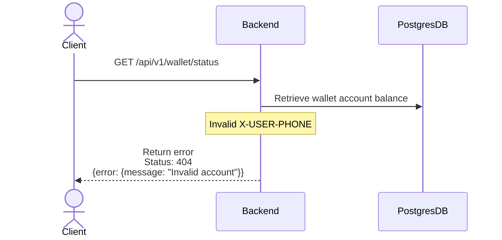

### Scenario 1: With correct X-USER-PHONE in headers

```mermaid
sequenceDiagram
    actor Client
    participant Backend
    participant PostgresDB

    Client->>Backend: GET /api/v1/wallet/status<br/>
    Backend->>PostgresDB: Retrieve wallet account balance by user phone number
    PostgresDB-->>Backend: Return eallet account balance
    Backend-->>Client: Return Success<br/>Status: 200<br/>{wallet: {id: "xxx", balance: 12000, formattedBalance: "RM 120.00"}}
```

### Scenario 2: With invalid X-USER-PHONE presented in headers

```mermaid
sequenceDiagram
    actor Client
    participant Backend
    participant PostgresDB

    Client->>Backend: GET /api/v1/wallet/status<br/>
    Backend->>PostgresDB: Retrieve wallet account balance
    Note over Backend: Invalid X-USER-PHONE
    Backend-->>Client: Return error<br/>Status: 404<br/>{error: {message: "Invalid account"}}
```

