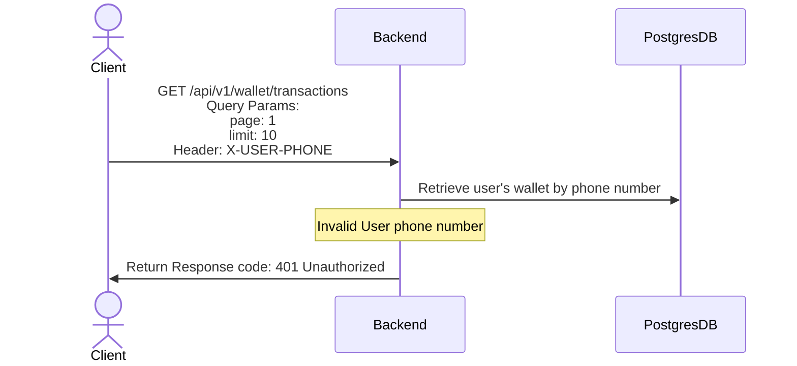
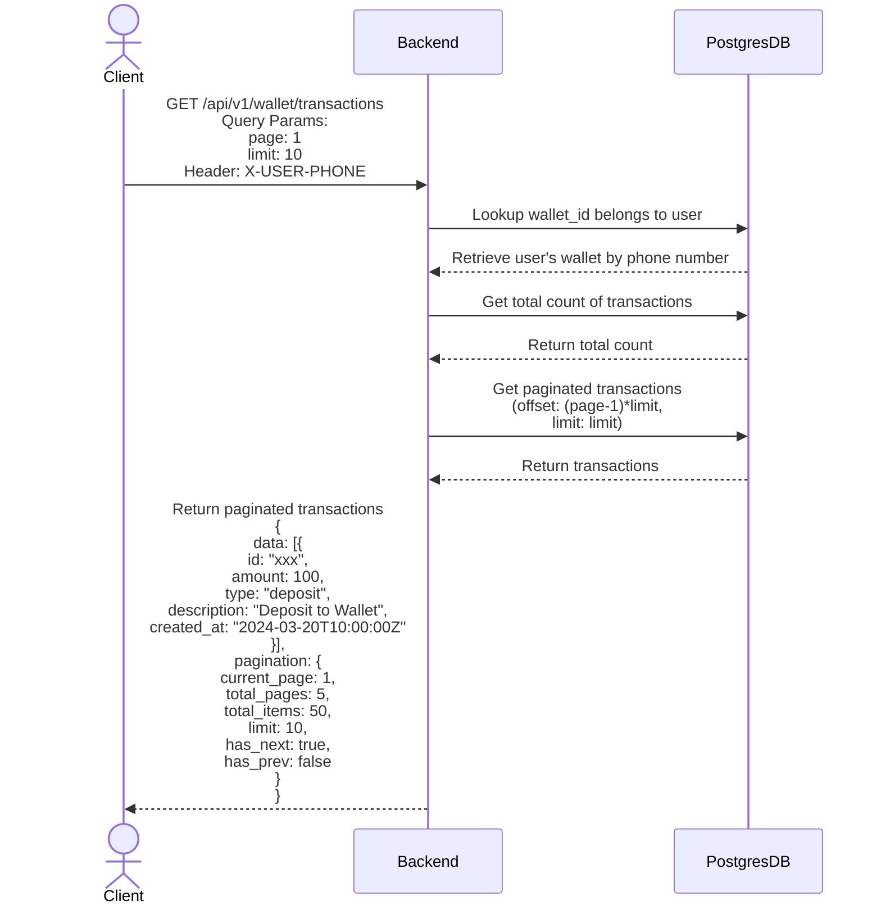

### Scenario 1: Invalid user id

```mermaid
sequenceDiagram
    actor Client
    participant Backend
    participant PostgresDB

    Client->>Backend: GET /api/v1/wallet/transactions<br/>Query Params:<br/>page: 1<br/>limit: 10<br/>Header: X-USER-PHONE
    Backend->>PostgresDB: Retrieve user's wallet by phone number
	Note over Backend: Invalid User phone number
	Backend->> Client: Return Response code: 401 Unauthorized
    

```

### Scenario 2: View wallet account transaction with pagination

```mermaid
sequenceDiagram
    actor Client
    participant Backend
    participant PostgresDB

    Client->>Backend: GET /api/v1/wallet/transactions<br/>Query Params:<br/>page: 1<br/>limit: 10<br/>Header: X-USER-PHONE
    Backend->>PostgresDB: Lookup wallet_id belongs to user
    PostgresDB-->>Backend: Retrieve user's wallet by phone number
    Backend->>PostgresDB: Get total count of transactions
    PostgresDB-->>Backend: Return total count
    Backend->>PostgresDB: Get paginated transactions<br/>(offset: (page-1)*limit,<br/>limit: limit)
    PostgresDB-->>Backend: Return transactions
    Backend-->>Client: Return paginated transactions<br/>{<br/>data: [{<br/>id: "xxx",<br/>amount: 100,<br/>type: "deposit",<br/>description: "Deposit to Wallet",<br/>created_at: "2024-03-20T10:00:00Z"<br/>}],<br/>pagination: {<br/>current_page: 1,<br/>total_pages: 5,<br/>total_items: 50,<br/>limit: 10,<br/>has_next: true,<br/>has_prev: false<br/>}<br/>}
```

