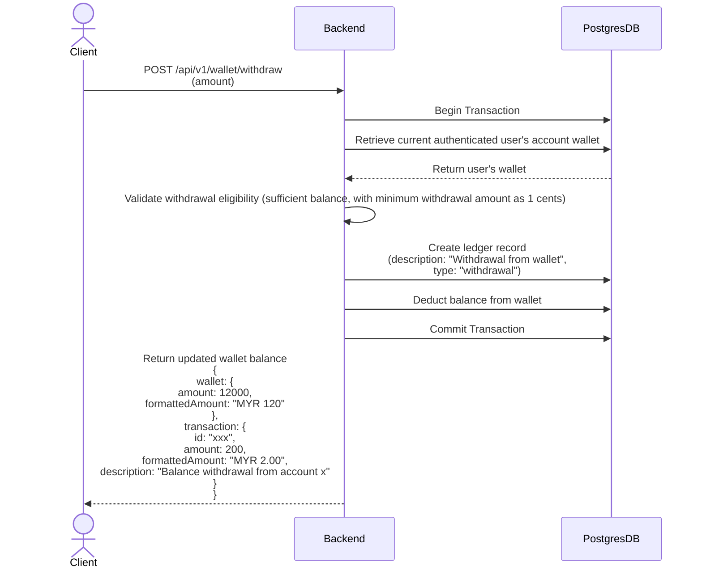
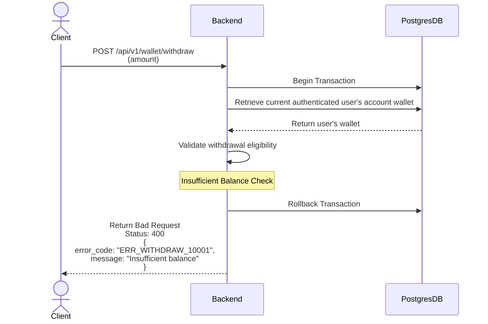
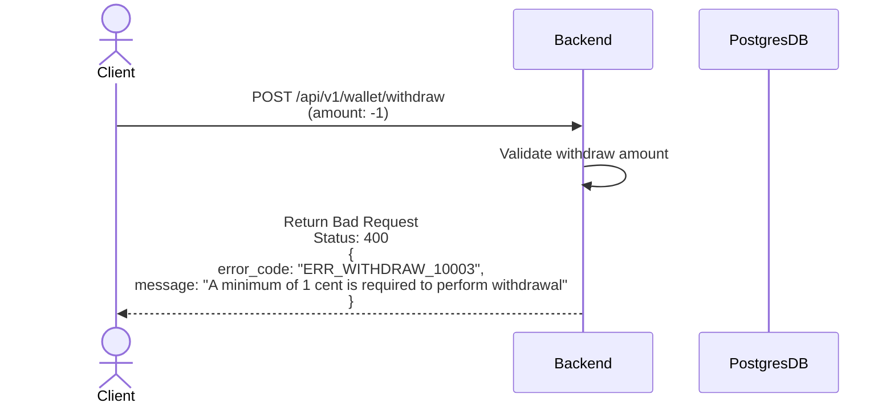

## Withdraw Money

### Scenario 1: User withdraw amount with sufficient wallet balance

### Scenario 2: User withdraw amount that is exceed the wallet balance

### Scenario 3: User withdraw with incorrect amount

